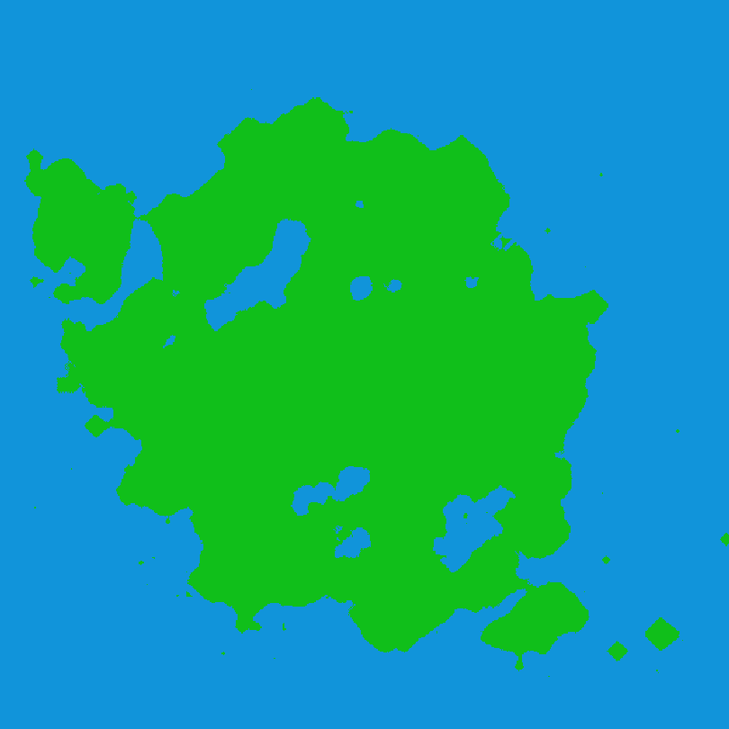
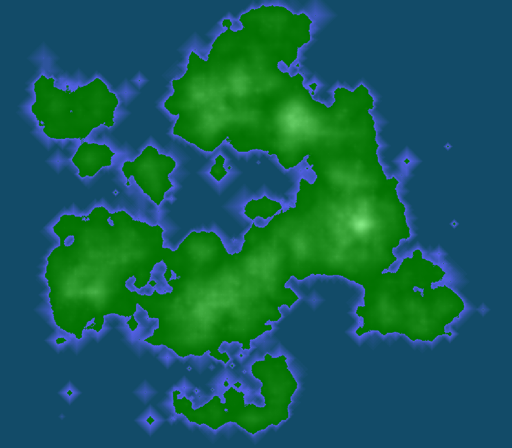

# Cartohelper

This project was meant as a learning project for a simple terrain generation algorithm and as a project to practice writing Go code.

## What has been implemented

The project started with the implementation of the GUI using the Fyne library. [Website](https://fyne.io/).

The basic terrain generation is based around what is called "blobs" in the code. These are pieces of terrain that elevate the terrain in a zone, a bit like throwing earth balls at the ground.

Because just adding pieces of terrain randomly did not give good results, I added the concepts of "continents", wich allows the generation to put many blobs in a smallest zone.

The other problem I faced after adding continents is that the terrain was now visibly delimiting the zones. The way I tackled this problem is by adding a "distribution map" that would modify the way blobs are placed.
Thus, when generating a new continent, some distribution centers are added, creating some kind of voronoi pattern. This greatly improved the results.

## What does not really work

My next objective for this project was to place rivers on the map.
In order to acheive that, I implemented shallow water simulation based on [this](https://inria.hal.science/inria-00402079) paper. The simulation seems to work but the erosion did not give
satisfactory results.
I also tried using only the fluid simulation without erosion to place rivers but the results were not great either.

## Conclusion

This project has been put on hold for the time being because I don't really have a solution for placing rivers. I might come back to it if I find something.

# Examples of generated terrain

A map with the default visualisation.

A map with the height visualisation.

